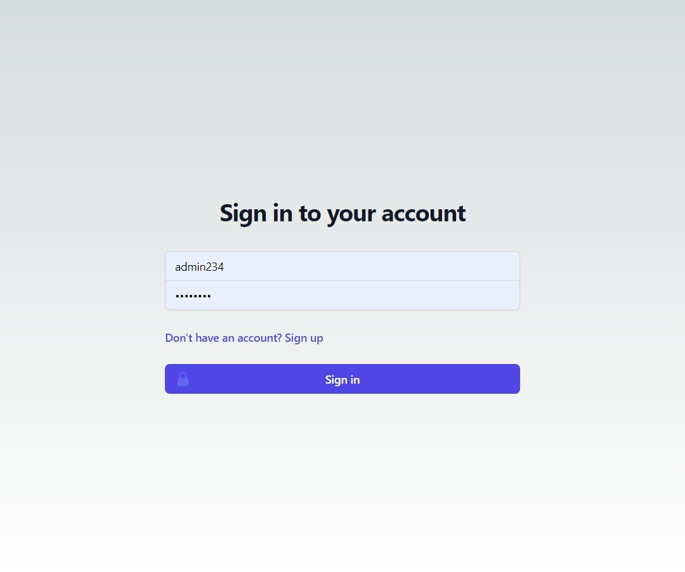
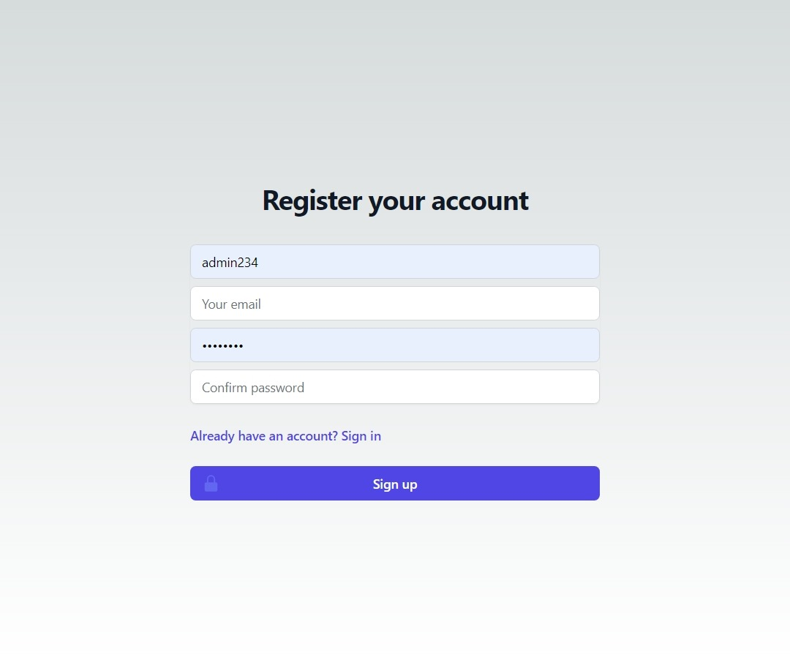
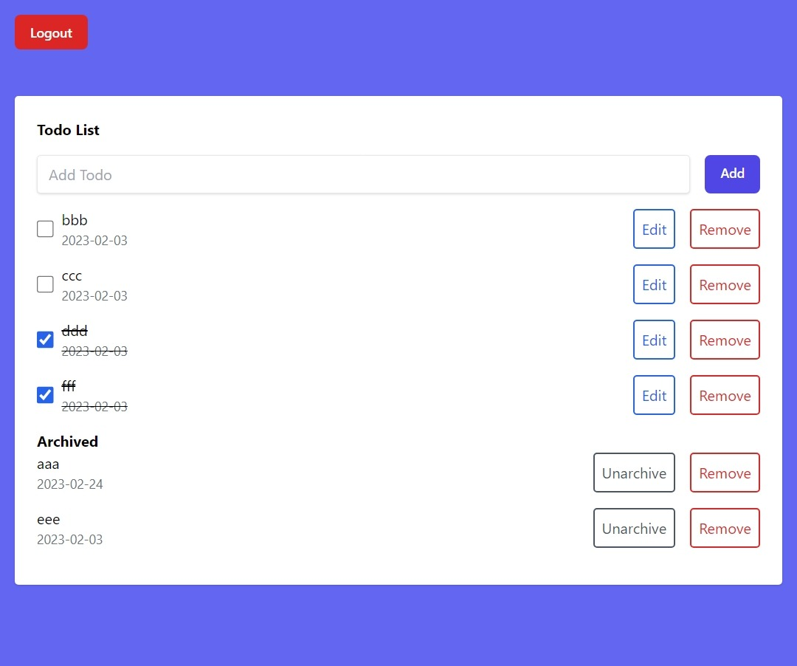
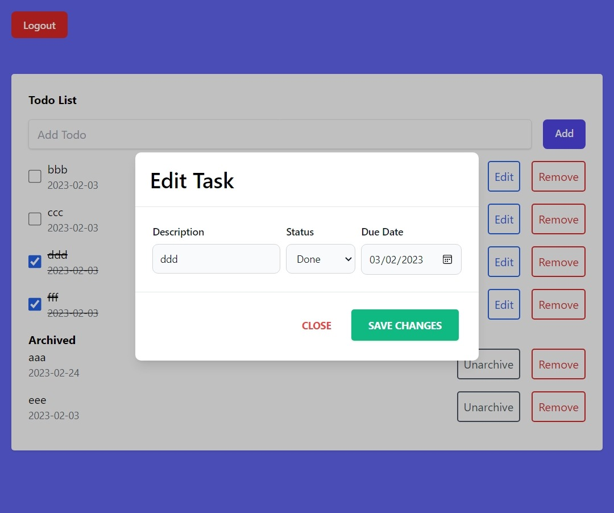

# Desafio de programação

## Lista de rotas desenvolvidas
A autenticação foi implementada com base na estratégia JWT
- **POST** `/token` - Login de usuário
- **POST** `/register` - Cadastro de usuário
- **GET** `/tasks` - Listar tarefas do usuário
- **POST** `/tasks` - Inserir tarefa
- **PUT** `/tasks/<int:task_id>` - Editar tarefa
- **DELETE** `/tasks/<int:task_id>` - Deletar tarefa

## Prints das telas desenvolvidas

Desafio: Criar uma aplicação web para gerenciar tarefas.
| Login | Cadastro | Lista de tarefas | Editar tarefa |
|---|---|---|---|
|  |  |  |  |

# Features

-   A aplicação deve permitir que o usuário crie, edite, altere o status e exclua tarefas.
-   As tarefas devem ter uma descrição e uma data de vencimento e um status.
-   A aplicação deve exibir uma lista de tarefas com seu status: A fazer, pendente, arquivada e completa.
-   O usuário deve ser capaz de alterar o status da tarefa.
-   Os dados das tarefas devem ser salvas em um banco de dados

Desafios adicionais: 
- Sistema de Login / Logout

# Entregáveis

- Aplicação back-end
- Aplicação front-end
- Descrição da aplicação com prints das telas desenvolvidas e lista de rotas do back-end
