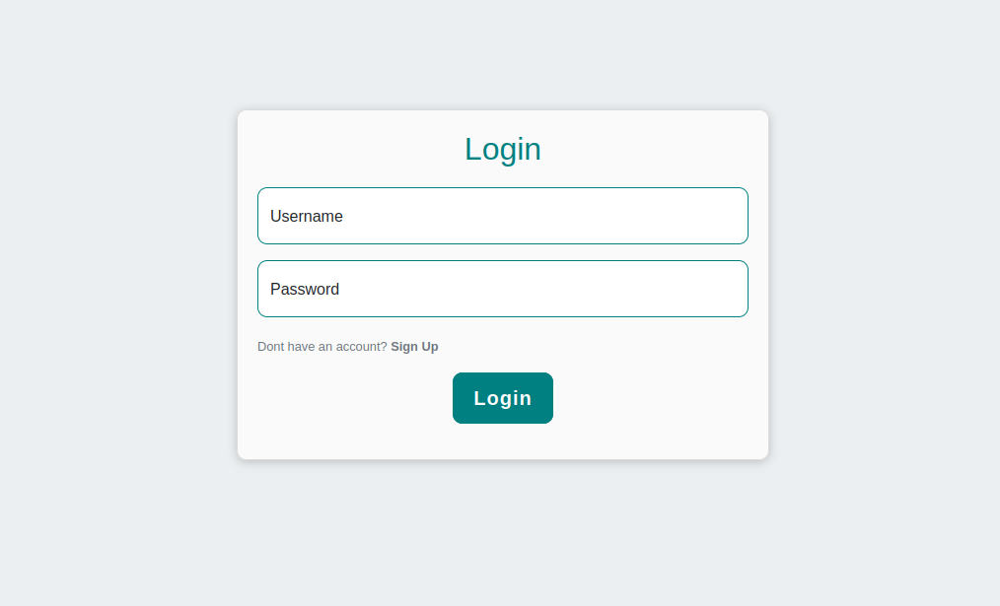
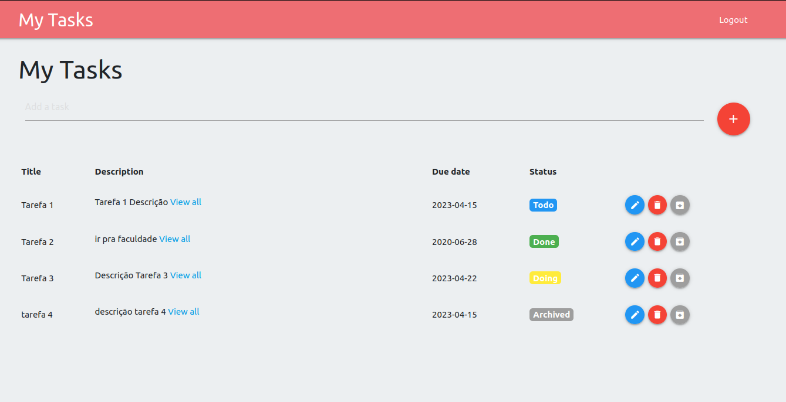
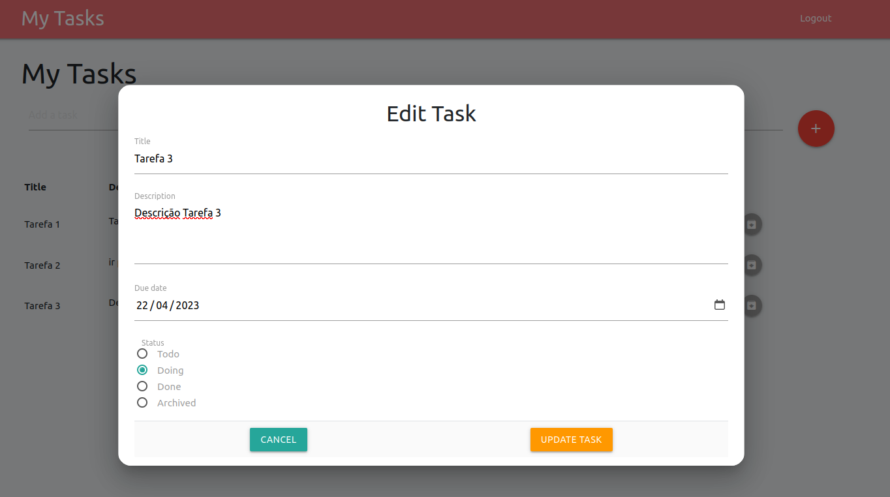
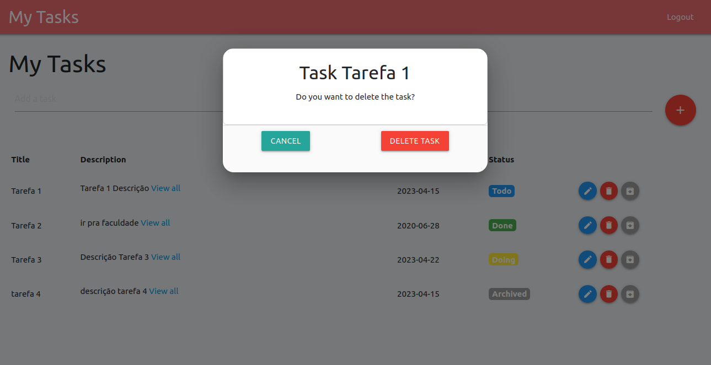

# Desafio de programação

Desafio: Criar uma aplicação web para gerenciar tarefas.

# Features

- [x]  A aplicação deve permitir que o usuário crie, edite, altere o status e exclua tarefas.
- [x]  As tarefas devem ter uma descrição e uma data de vencimento e um status.
- [x]  A aplicação deve exibir uma lista de tarefas com seu status: A fazer, pendente, arquivada e completa.
- [x]  O usuário deve ser capaz de alterar o status da tarefa.
- [x]  Os dados das tarefas devem ser salvas em um banco de dados

Desafios adicionais: 
- [x] Sistema de Login / Logout

# Entregáveis

## Aplicação back-end
Aplicação backend foi implementado em python usando o framework Django, usando o pacote e subpacotes "django rest framework"
para montar a API com as Views, Viewsets, Autenticação, Serializer e outros.

O banco de dados utilizado foi o postgreSQL, para comunicação do backend com o banco de dados foi realizado através do pacotre psycopg2.

As configuração para a conexão está no arquivo task-manager-django/task-manager/.env

As rotas configuradas no backend são:
- **localhost:8000/admin**
    - **GET**
    - Rota do admin django
- **localhost:8000/signup** 
    - **POST**
    - { username, email, password }
    - Cadastro de usuário
- **localhost:8000/login**
    - **POST**
    - { username, password }
    - Autenticação 
- **localhost:8000/refresh-token**
    - **POST**
    - { refresh }
    - Atualizar token de acesso
- **localhost:8000/tasks**
    - **POST/GET/PUT**
    - Crud de Tasks
- **localhost:8000/tasks/<int:task_id>**
    - **DELETE**
    - Deletar task

## Aplicação front-end

A aplicação frontend foi implementada em angular, usando framework de css materialize.

As rotas configuradas no frontend são:

- **localhost:4200/login**
    - Autenticação
- **localhost:4200/logout**
    - Logout
- **localhost:4200/signup**
    - Cadastro de usuário
- **localhost:4200/tasks**
    - Listagem das tarefas do usuaŕio autenticado

# Telas

## Login

## Sign up

## Listagem das tarefas

## Editar Tarefa

## Deletar Tareta
